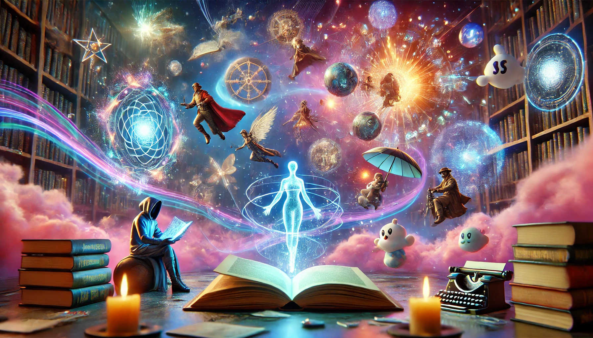
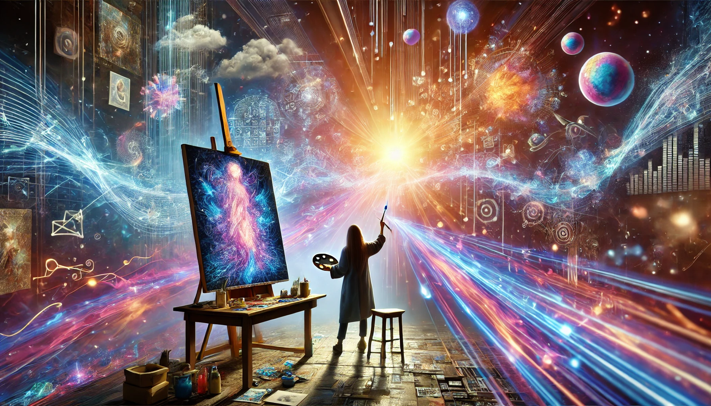

# SuperAbundance - Creating the Future, Atom by Atom, Idea by Idea

<link rel="stylesheet" href="styles/style.css">

At Super Abundance, we believe the exponential growth of technology—particularly Atomically Precise Manufacturing (APM), molecular nanotechnology, artificial intelligence, and Web3—is ushering in a new era of Radical Abundance. We stand at the dawn of an age where scarcity becomes obsolete, and humanity thrives with limitless potential.

Our mission is to accelerate the commercialization and adoption of breakthrough technologies that enable the amplification of human creativity, the precise control of matter, and the decentralization of ownership and opportunity.

Our first product, TellUrStori, embodies this vision by democratizing, amplifying, and accelerating human creativity. We are entering a renaissance unlike anything in human history, where generative AI unlocks Hollywood-level storytelling for everyone, and Web3 empowers creators to own and monetize their work in ways never before possible. TellUrStori is Super Abundance for creativity, providing artists, musicians, and storytellers with the ultimate creative canvas—where imagination meets infinite possibility.

At Super Abundance, we believe that a symbiotic relationship between AI, nanotechnology, and decentralized systems will transition humanity from an era of scarcity to one of abundance, longevity, and planetary stewardship. By funding, building, and accelerating this technological singularity, we ensure that these breakthroughs serve all of humanity and lead to a golden age of prosperity, knowledge, and exploration.

